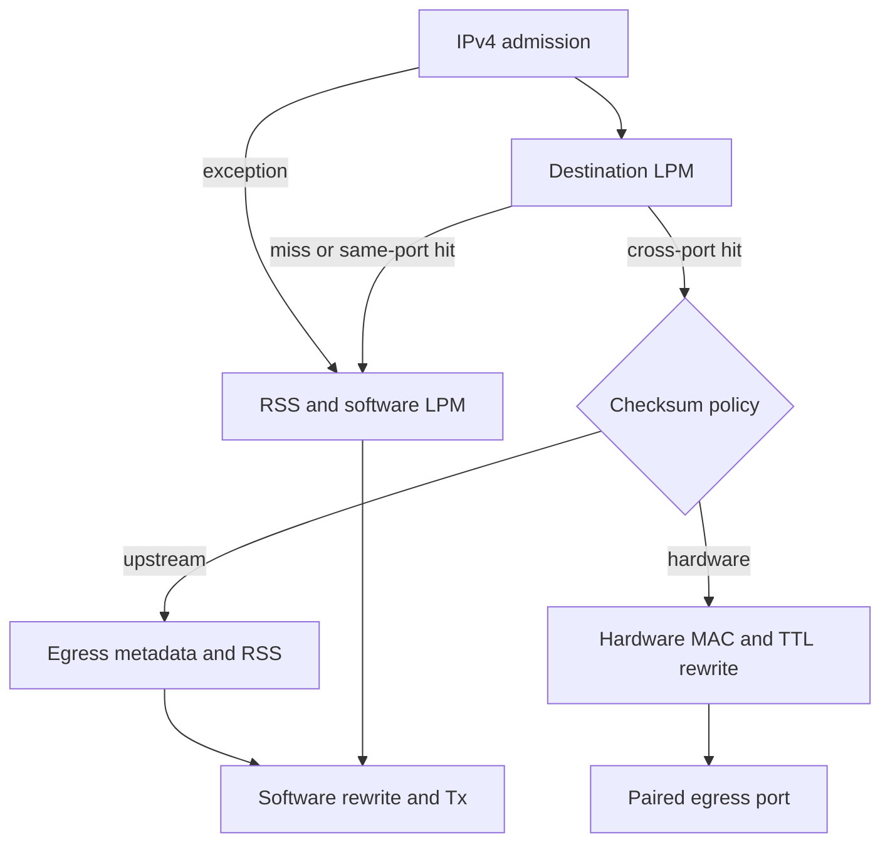

# Migrating DPDK l3fwd to DOCA Flow

This guide walks through the implemented, hardware-tested migration in this
repository. The result is a two-port IPv4 LPM application with a software backend
and a DOCA Flow backend. It preserves an unmodified upstream executable as the
reference and makes the hardware/software split explicit.

**Verified implementation:** [`3bf7908`](https://github.com/aknvda/dpdk-l3fwd-to-docaflow/commit/3bf790805acfe59ab0dcce4cc24c0684361db339).
The complete 1024-route, 2326-packet corpus passed twice on real hardware with
exact upstream output bytes. See [measured results](RESULTS.md).

## 1. Define the behavior before moving work to hardware

The reference is DPDK **v25.11.0**, commit
[`ed957165`](https://github.com/DPDK/dpdk/tree/ed957165eadbe60a47d5ec223578cdd1c13d0bd9/examples/l3fwd),
using IPv4 LPM and poll mode. The broader upstream sample supports additional
lookup and packet-I/O modes; this migration deliberately implements this one
path. The [DPDK sample guide](https://doc.dpdk.org/guides-25.11/sample_app_ug/l3_forward.html)
provides background; the pinned source and recorded executable output define
this project's compatibility target.

Read the lookup in
[`l3fwd_lpm.c`](https://github.com/DPDK/dpdk/blob/ed957165eadbe60a47d5ec223578cdd1c13d0bd9/examples/l3fwd/l3fwd_lpm.c)
and the rewrite in
[`l3fwd_lpm.h`](https://github.com/DPDK/dpdk/blob/ed957165eadbe60a47d5ec223578cdd1c13d0bd9/examples/l3fwd/l3fwd_lpm.h)
and
[`l3fwd_common.h`](https://github.com/DPDK/dpdk/blob/ed957165eadbe60a47d5ec223578cdd1c13d0bd9/examples/l3fwd/l3fwd_common.h).
The important behaviors are longest-prefix selection, returning misses to ingress,
rewriting both Ethernet addresses, decrementing TTL, and incrementing the stored
IPv4 checksum word directly. A sample's behavior can differ from a full RFC router:
TTL 0/1 and checksum boundaries must be characterized rather than assumed.

Our route loader accepts prefixes /1 through /32, logical ports 0/1 and up to
1024 unique routes. Duplicate normalized prefixes use the last value; /0 is
rejected. The baseline and migration consume the same generated routes and frames.

## 2. Choose the compatibility policy

There is no general one-to-one replacement of DPDK APIs with DOCA Flow calls.
Retain DPDK for memory, queues and software handling; move eligible packet
classification and actions into a hardware pipeline.

| Application policy | DOCA work | CPU work | Compatibility |
| --- | --- | --- | --- |
| `--checksum-policy upstream` (default) | Admission and eligible cross-port LPM; selected egress returned as metadata | Rewrite and transmit **every packet**; software LPM for exceptions | Exact upstream bytes on the verified corpus |
| `--checksum-policy hardware` | Admission, eligible cross-port LPM, MAC/TTL/checksum rewrite and paired-port forwarding | Lookup, rewrite and transmit exceptions | Ten known checksum differences in the verified corpus |

In hardware mode, input checksum `feff` produces `0000` instead of upstream
`ffff`; both output encodings are valid. Valid input `ffff` produces hardware
`0100` instead of upstream `0000`, whose checksum is invalid after the TTL change.
The standard match fields used here do not distinguish those checksum values.
Exact mode therefore preserves upstream's raw increment in software for all
packets, not just a list of known test cases. That costs CPU work and is not a
claim of forwarding acceleration.

Both policies are useful: exact mode establishes a migration reference;
hardware mode exposes the offload path with an explicit semantic difference.
The software-only backend accepts the upstream policy only.

## 3. Map the responsibilities into code

| Original responsibility | Migrated implementation |
| --- | --- |
| Parse route rules and preserve miss behavior | [`src/forward.c`](../src/forward.c): `l3_routes_read`, `l3_lookup` |
| Initialize EAL, mbufs and Rx/Tx queues | [`src/main.c`](../src/main.c): `configure_port` and the polling loop |
| Select only admitted physical devices | [`src/device.c`](../src/device.c): `l3_devices_open`, explicit DOCA device open and `doca_dpdk_port_probe(..., "dv_flow_en=2")` |
| Move destination lookup into hardware | [`src/flow.c`](../src/flow.c): `route_pipe`, `DOCA_FLOW_PIPE_LPM`, `doca_flow_pipe_lpm_add_entry` |
| Preserve exact packet changes | `route_assist_pipe` supplies metadata; `l3_forward_selected` rewrites without another lookup |
| Offload packet changes | `rewrite_pipe`: egress MACs, eight-bit TTL ADD of 255, counted forwarding to the paired port |
| Handle misses and exceptions | `exception_pipe` sends unchanged packets through RSS to queue 0; `l3_forward` performs software lookup/rewrite |
| Prove installation and clean up | `finish_entry`, `entry_completed`, `l3_flow_stop`; [`src/netstate.c`](../src/netstate.c) restores interface state |

Each ingress has this pipeline:



Admission requires untagged, unfragmented IPv4 with IHL 5, valid parser L3/checksum
flags and TTL 2..255. Same-port routes and misses go to software. The root uses
254 TTL entries; each port also has one LPM entry per route and one counted
rewrite/metadata entry. This is functional implementation, not optimized rule
insertion or a measured NIC capacity limit.

In exact mode, register DPDK dynamic metadata before configuring ports. DOCA's
`pkt_meta` value is supplied in network byte order; DPDK exposes the selected value
in host order. Check the metadata-valid flag, marker and port bounds before using
it, and clear the shared Rx/Tx metadata flag before transmission. The validation
requires both hardware lookup counts and matching consumed-metadata counts: an
accidental software-only fallback cannot pass as hardware-assisted routing.

## 4. Build the baseline and both backends

Use Linux x86_64 with GCC, Meson, Ninja, pkg-config, Python 3.10+, pyelftools,
libnuma-dev and libpcap-dev. The tested DOCA stack is **3.3.0109** with its packaged
**DPDK 25.11.0+doca2601.2**. [`meson.build`](../meson.build) admits DOCA 3.3 only;
do not link that backend against the unrelated upstream DPDK build.

```bash
git clone --recurse-submodules https://github.com/aknvda/dpdk-l3fwd-to-docaflow.git
cd dpdk-l3fwd-to-docaflow

# Unmodified upstream reference, including the file-backed PCAP PMD.
meson setup build/dpdk upstream/dpdk -Dplatform=generic -Dexamples=l3fwd \
  -Dtests=false -Denable_drivers=net/pcap -Dmax_numa_nodes=1
ninja -C build/dpdk -j4

# Migrated software backend linked against the same reference DPDK build.
PKG_CONFIG_PATH="$PWD/build/dpdk/meson-uninstalled" \
  meson setup build/software -Ddoca=disabled \
  -Dpcap_driver_dir="$PWD/build/dpdk/drivers"
ninja -C build/software

# DOCA backend: use the actual SDK package location on your system.
PKG_CONFIG_PATH=/opt/mellanox/dpdk/lib/x86_64-linux-gnu/pkgconfig \
  meson setup build/doca -Ddoca=enabled
ninja -C build/doca
meson test -C build/software --print-errorlogs
meson test -C build/doca --print-errorlogs
L3_APP="$PWD/build/software/l3fwd-docaflow" python3 -m unittest discover -s tests -v
L3_APP="$PWD/build/doca/l3fwd-docaflow" python3 -m unittest discover -s tests -v
bash scripts/test_core.sh
```

These checks do not acquire physical ports. The software backend allows only two
file-backed `net_pcap` devices. The DOCA backend opens two explicitly selected
functions on one isolated adapter; it does not configure switch mode or representors.

## 5. Establish the immutable packet reference

Set `PRIVATE_RESULTS` to an existing private directory outside every Git checkout.
Run both real executables against the same full corpus:

```bash
: "${PRIVATE_RESULTS:?Set a private results directory outside Git}"
python3 tests/pcap_smoke.py --binary build/dpdk/examples/dpdk-l3fwd \
  --extended --route-count 1024 --output "$PRIVATE_RESULTS/reference"
python3 tests/pcap_smoke.py --binary build/software/l3fwd-docaflow --target software \
  --extended --route-count 1024 --output "$PRIVATE_RESULTS/software"
```

Both must produce `status: PASS`, 2326 packets, and egress counts 1140/1186.
Each run observes 30 seconds including startup, then compares complete frames and
multiplicity. The corpus includes overlap/misses, TTL 0/1/2/64/255, four frame
sizes, checksum boundaries, and 1019 additional /32 routes from both ingress ports.

Set `UPSTREAM_REFERENCE` to the exact passing upstream `run-*` directory printed
by the first command. Generated inputs alone are not reference evidence. The
physical loader verifies the actual upstream outputs and corpus integrity, then
adapts only Ethernet addresses for the physical test.

## 6. Validate the real NIC end to end

Reserve a supported two-port adapter separately from management. Both functions
must be DOWN and unaddressed, with MTU 1500, no active VFs and no upper interfaces.
Provide device/root access, adequate hugepages and locked memory, and a compatible
mlx5/firmware/SDK stack. Keep the bifurcated mlx5 driver model; these instructions
do not call for unbinding to vfio-pci.

The demonstrated cable-free fixture uses ConnectX-6 Dx firmware 22.48.1000 and
MFT `mlxlink`/`mlxreg` internal PHY controls. It sends real packets through the NIC,
DOCA pipeline and application. It requires no external generator adapter or cable
on that tested combination. Other hardware must establish its own admission and
loopback support. See [requirements](VALIDATION.md).

Create a private `LAB_CONFIG` JSON file outside Git with exactly `doca_binary`
(absolute executable path), `dut_pci` (two reserved functions in logical-port
order), and `cpu` (an available reserved CPU). Do not publish real values.

```bash
: "${LAB_CONFIG:?}" "${UPSTREAM_REFERENCE:?}" "${PRIVATE_RESULTS:?}"
python3 tests/wire_smoke.py --config "$LAB_CONFIG" \
  --reference "$UPSTREAM_REFERENCE" --output "$PRIVATE_RESULTS/physical" \
  --internal-loopback --preflight-only

# Exact upstream bytes: run twice, with a clean shutdown between runs.
for trial in 1 2; do
  sudo python3 tests/wire_smoke.py --config "$LAB_CONFIG" \
    --reference "$UPSTREAM_REFERENCE" --output "$PRIVATE_RESULTS/physical" \
    --internal-loopback --allow-physical-ports --checksum-policy upstream
done

# Explicit full-offload policy, with its documented checksum contract.
sudo python3 tests/wire_smoke.py --config "$LAB_CONFIG" \
  --reference "$UPSTREAM_REFERENCE" --output "$PRIVATE_RESULTS/physical" \
  --internal-loopback --allow-physical-ports --checksum-policy hardware
```

Preflight is read-only. Execution uses the same policy in the DUT and checker,
waits for readiness, sends at 200 aggregate packets/s and observes three seconds
after replay. The test-only capture pipes terminate returned packets in the
kernel; normal application runs omit them. The runner disables loopback and
restores interfaces/settings after exit. It never flashes firmware or resets
an adapter. See [the exact packet path and cleanup](INTERNAL_LOOPBACK.md).

For ordinary operation, use the [application launch command](../README.md#hardware-validation)
with supplied next-hop MACs and no loopback-test flag. Normal-mode startup and
shutdown passed with both policies and 1024 routes. Packet delivery without the
loopback fixture still requires an external connected path; the
[external-wire runner](WIRE_VALIDATION.md) is provided but that interoperability
result has not been measured.

## 7. Read the acceptance evidence

For this exact corpus, the measured counters are:

| Counter | Upstream policy | Hardware policy |
| --- | --- | --- |
| `hardware_lookups` by ingress | 557 / 542 | 0 / 0 |
| `software_hw_lookup` by ingress | 557 / 542 | 0 / 0 |
| `hardware_forwarded` by ingress | 0 / 0 | 557 / 542 |
| `software_rx` by ingress | 1163 / 1163 | 606 / 621 |
| `software_tx` by egress | 1140 / 1186 | 598 / 629 |
| Captured frames by egress | 1140 / 1186 | 1140 / 1186 |
| `upstream_byte_equivalent` | `true` | `false` |

PASS also requires exact complete output frames, zero application/capture drops,
zero deltas for twelve NIC error/discard counters, successful process exit,
no SDK errors, and verified restoration. Hardware counters alone do not prove
packet delivery. The internal fixture's physical Rx and Tx counts each include
both injected inputs and returned outputs.

Retain the source revision, binary/reference hashes, commands, SDK log, captures,
physical counters and restoration result privately. Publish only sanitized
summaries. Credentials belong only in the ignored root `.env`, mode `0600`; the
application and test runner do not consume passwords.

## 8. Carry these lessons into another migration

- **Complete asynchronous rule processing.** Submission success is insufficient.
  Process the queue and verify callbacks before announcing readiness.
- **Use an explicit RSS exception pipe.** The tested SDK path uses pipe forwarding
  for misses rather than a direct RSS miss action.
- **Destroy in dependency order.** Remove incoming pipe references first, then
  flush both paired ports before stopping either. Clean partial initialization too.
- **Separate admission from correctness.** Firmware capability rejection before
  port creation says nothing about whether an application rule is correct.
- **Preserve the oracle.** Keep checksum and TTL edges in the corpus; document any
  intentional semantic difference instead of weakening strict comparisons.
- **Separate functional and performance claims.** A low-rate PASS establishes the
  tested behavior, not line rate, latency, or benefit from a different CPU platform.

This project is complete for the documented two-port IPv4 functional scope.
IPv6/VLAN routing, ARP/ND or ICMP generation, dynamic updates, multiple workers,
jumbos and full malformed/options/fragment equivalence are outside that scope.
Per-flow ordering, external-link recovery, throughput/latency and Vera/Substrate
multiplexing require separate experiments in [VALIDATION.md](VALIDATION.md).
